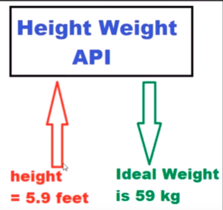
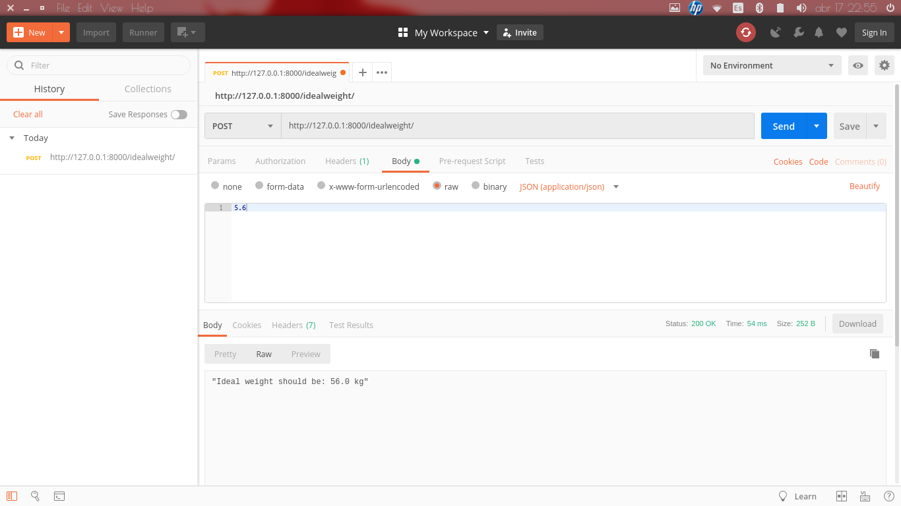

# Create Simple API using Python Django REST Framework

1. First install dependencies

    `$ pip install django djangorestframework`

2. Inside project folder create a django project

    `$ django-admin startproject <project-name>`

3. Inside the django project folder run the following command to create the web project folder (run with v3 of python).

    `$ python manage.py startapp <app-name>`

4. Inside my django project folder and settings.py file under INSTALLED_APPS add two lines with

    ~~~~json
    'rest_framework',
    'MyApp'
    ~~~~

5. Then in views.py we will calculate the logic for calculating the ideal weight given the height.
Replace with the following lines:

    ~~~~python
    from django.shortcuts import render
    from django.http import Http404
    from rest_framework.views import APIView
    from rest_framework.decorators import api_view
    from rest_framework.response import Response 
    from rest_framework import status
    from django.http import JsonResponse
    from django.core import serializers
    from django.conf import settings
    import json

    # Create your views here.
    @api_view(["POST"])
    def IdealWeight(heightdata):
        try:
            height = json.loads(heightdata.body.decode('utf-8'))
            weight = str(height*10)

            return JsonResponse("Ideal weight should be: " + weight + " kg", safe=False)
        except ValueError as e:
            return Response(e.args[0], status.HTTP_400_BAD_REQUEST)
    ~~~~

6. Then in urls.py add the url to access this method we just created.

    ~~~~python
    from django.contrib import admin
    from django.conf.urls import url
    from MyApp import views

    urlpatterns = [
        url(r'^admin/', admin.site.urls),
        url(r'^idealweight/', views.IdealWeight)
    ]
    ~~~~

7. After that, run the backend server using

    `$ python manage.py runserver`

    maybe this command throws an error and you have to migrate first

    `$ python3 manage.py migrate`

    If this throws an error of port already in use simply type:

    `$ sudo fuser -k 8000/tcp`

8. Finally, to test the API we should install postman. In my case, using Ubuntu first install snap,

    `$ sudo apt install snapd snapd-xdg-open`

    and then postman (there are alternatives to this obviously)

    `$ snap install postman`

